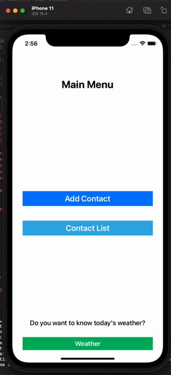
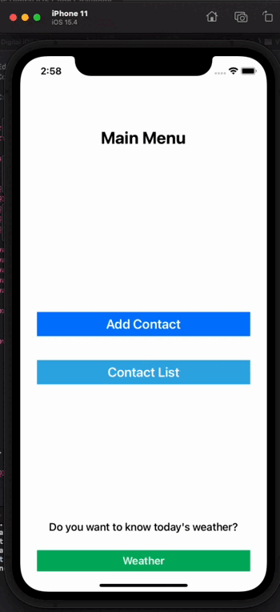

# Columbus Code Challenge 

_Aplicación funciona como libreta de contactos, permite Agregar Contactos, Visualizar Contactos y Editar Contactos._
_Se incluyo la conectividad a la API (7Timer), para visualizar sus datos._

## Preview

    

## Construido con 🛠️

* [Swift Package Manager](https://developer.apple.com/documentation/swift_packages/adding_package_dependencies_to_your_app) - Gestor/Manejador de dependencias
* [Alamofire](https://github.com/Alamofire/Alamofire) - Librería que nos permite realizar peticiones HTTP para la sección de Weather
* [MVP] - Patrón de diseño

Desarrollado por [Arturo@7th.dev](https://gitlab.com/Arturo.7th.Dev) 😊
